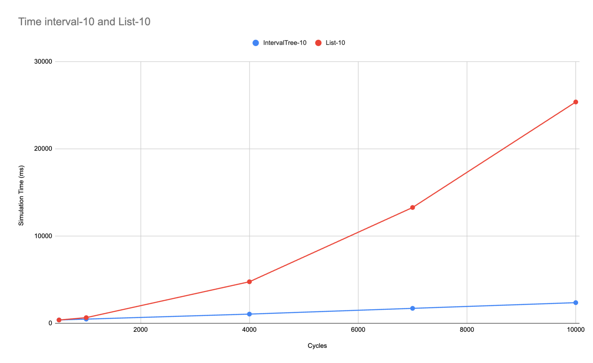

# Sedaro Nano Project Writeup

## Changes and Enhancements

### Backend

#### **QRangeStore Optimization**
- **Change:** Replaced the list-based range storage with an **IntervalTree**.
- **Justification:**
  - The original implementation used a list, requiring **O(n)** lookup time to retrieve overlapping ranges.
  - An **IntervalTree** reduces lookup complexity to **O(log n)**, significantly improving efficiency.
  - This change is particularly beneficial when handling a large number of range queries.
- **Impact:**
  - Improved query performance for retrieving relevant values.
  - Enhanced scalability and responsiveness.
  - Below is an image visualizing the efficiency gains when we have 10 bodies.
  - More in depth testing data is available in the SimData.xlsx file
  

#### **Propagation Function Optimization**
- **Change:** Replaced NumPy-based calculations with **CUDA acceleration via Numba**.
- **Justification:**
  - The original implementation computed gravitational interactions using NumPy, which is limited by single-threaded execution.
  - Utilizing **CUDA parallelization**, the propagation function can leverage GPU acceleration for faster computations.
  - This optimization is particularly valuable for multi-body simulations.
- **Impact:**
  - Reduced computation time per cycle.
  - Enabled handling of a greater number of celestial bodies efficiently.
  
---

### Frontend

#### **Graphical Representation Upgrade**
- **Change:** Switched from a static plot of position over time to an **interactive ThreeJS-based 3D simulation**.
- **Justification:**
  - Original visualization lacked interactivity and real-time updates.
  - ThreeJS provides a **more immersive** representation, allowing users to dynamically view simulation changes.
- **Impact:**
  - More engaging and visually intuitive representation of orbital mechanics.
  - Better user control over simulation parameters.

#### **Input Enhancements**
- **Change:** Added **N-body input support** and slider to set number of **simulation cycles** and **time steps**.
- **Justification:**
  - The original implementation was limited to 2 bodies, restricting simulation complexity.
  - Allowing any number of bodies increases flexibility and realism.
  - Fixed values for simulation cycles (500) and timestep (0.1) did not meet diverse user needs.
  - Sliders for these parameters enable user customization.
- **Impact:**
    - Allows user to simulate more complex simulations
    - Creates a more versatile system

---

## Future Improvements

### **If Given More Time**
- **Data Upload Support:** Allow users to upload initial conditions with file instead of manual input.
- **Smooth Animation:** Implement **linear interpolation (LERP)** in ThreeJS for smoother motion.
- **Database Integration:**
  - Introduce **MongoDB** for efficient data storage.
  - Avoids complex relational dependencies while ensuring **fast access times**.
- **Mass-Proportional Rendering:** Scale bodies based on mass.
  - This was omitted due to lack of density information.

---

## Design Choices and Trade-offs

### **What I Didn't Do and Why**

#### **Real-Time Streaming**
- **Reason:** The simulation executes rapidly, making real-time playback unnecessary. If this were to become a requirement, I would create a buffered playback mechanism to reduce any mismatch between simulation and playback speed.

#### **Native CUDA Implementation**
- **Reason:** While CUDA with Numba provided speed improvements, rewriting the entire simulation in raw CUDA was not pursued due to:
  - Lack of bottleneck testing.
  - The relative simplicity of the simulation not justifying extreme optimization.

---

# Sedaro Nano

The tiniest possible mockup of our system

## Goal

The goal of this mini-project is to gain a better understanding of your ability to **be creative**, **think through problems**, and **solve relevant challenges** related to the engineering roles at Sedaro. This is an opportunity for you to show off your personal strengths. Don't focus on the simple contributions and instead aim to really impress us. To best set expectations, we won't be impressed by an ability to write boilerplate or copy and paste tutorials. A submission that makes us say "Wow, that's SMART!" is far better than one that makes us say "This is really robust.". Get creative, the prompt is intentionally very open-ended.

Within the next `7` days, attempt the following mini-project and return your solution containing the full project (less anything that would be .gitignored such as `node_modules`) and any notes on how to setup and run your specific solution. As important as your solution, we are interested in understanding your thought process and your ability to clearly communicate your approach so a writeup should also be included. For the writeup, include some details on your solution, any novel or creative aspects of the solution, and what additional features or improvements you would add if you were given more time.

Please note that if you end up getting to a solution that you aren't happy with or that is a dead end, document why and we will call that good enough. Please don't invest too much time. A writeup of why a solution is insufficient and how you might approach it differently often tells us what we need to know.

If you have any questions or issues while you work through this problem or if you get stuck, please contact Bas Welsh at sebastian.welsh@sedarotech.com.

Once you have completed your solution, please follow the submission steps below.

## Setup

1. Clone this repository.
   - Please note that **only** cloning via HTTPS is supported
   - Please **do not** commit changes to any branch of this repository. If you would like to use git, you may fork this repository to create a private repo of your own
2. Ensure that Docker is installed and running. To compile and run the app, execute the following command
   - `docker compose up`
   - Ensure your localhost ports `3030` and `8000` are available first.
3. That's it ✅! Sedaro Nano should now be available via web browser at http://localhost:3030/. The API is running at http://localhost:8000/.
   - It may take a few moments for the container to fully come up and serve the page.
   - Changes to both the React app and the Flask app should auto reload.

## Submission

1. Remove any temporary or .gitignored files/directories, such as `__pycache__`, `node_modules`, or any local virtual environments.
2. Include a writeup as detailed in the **Goal** section above. If relevant to your solution, please include screenshots and/or a link to a video.
3. Compress your entire `sedaro_nano` directory into a `.zip` file.
4. Email your solution to kacie.neurohr@sedaro.com and the other email(s) listed in the original instructions. Our mail server will often block submissions so we recommend sharing the .zip with us via a Google Drive link (or similar sharing service).

## Your Task

Included in this directory is a tiny mockup of Sedaro's system. Though it technically comprises a full-stack app, there are _many_ areas in which it could be improved.

**Review the files that make up Sedaro Nano, figure out how it works, and then add to it in whatever ways <u>best</u> show off your unique skills + creativity!**

### Some Project Ideas

- Simulator:
  - Improve the Q-Range KV Store data structure
  - Make the system more generic/extensible
  - Make it fast
- Front End:
  - Revamp the UI/UX with cool visualizations and interactivity
  - Live-stream the simulation
  - Show off your best creative work with a redesign
- App
  - Add unique patterns of user engagement
  - Make the simulation runtime parallel/asynchronous
- Data:
  - Create a more scalable storage solution than a JSON string in one DB row
  - Do some statistical analysis on the data
  - Set up background jobs to preprocess data
- Modeling & Simulation:
  - Improve the numerical stability of the simulation functions
  - Implement additional modeling and simulation scope
  - Analyze the sensitivity to initial conditions
- Etc:
  - Incorporate computational optimizations (e.g. linear programming)
- Whatever you want; these are just suggestions to get you thinking

